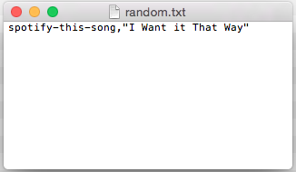

# LIRI Bot

### Overview

This assignment is to create 'LIRI.'  LIRI is like iPhone's SIRI. However, while SIRI is a Speech Interpretation and Recognition Interface, LIRI is a _Language_ Interpretation and Recognition Interface. LIRI is a command line node app that takes in parameters and gives you back data.

NPMs utilized in this exercise were `fs`, `twitter`, `node-spotify-api`, `request`, and `imdb-api`.


- - -

There are FOUR commands that the user can enter into the console/command line:

```
...
function doWhatItSays(command, args){
  if (command === 'my-tweets'){
    show20Tweets();
  } else if (command === 'spotify-this-song') {
    showSongInfo(args);
  } else if (command === 'movie-this') {
    showMovieInfo(args);
  } else {
    console.log('This is an error.\r\n \r\nPlease enter: \r\n \r\nmy-tweets, \r\nspotify-this-song, \r\nmovie-this, or \r\ndo-what-it-says\r\n \r\nfollowing the liri.js command. \r\n');
  }
}
...
```


### 1. `node liri.js my-tweets`

This will show a Twitter user's last 20 tweets and when they were created at in your terminal/bash window.

_(This example uses a Twitter account - QMichauxii - created for this exercise. At this writing, only a few tweets had been posted to this account.)_


  


### 2. `node liri.js spotify-this-song '`*song name here*`'`

This will show the following information about the song in your terminal/bash window:
  * Artist(s)
  * The song's name
  * A preview link of the song from Spotify
  * The album that the song is from

  

If no song is provided, then your program will default to
"The Sign" by Ace of Base:

  


### 3. `node liri.js movie-this '`*movie name here*`'`

This will output the following information to your terminal/bash window:

  * Title of the movie.
  * Year the movie came out.
  * IMDB Rating of the movie.
  * Country where the movie was produced.
  * Language of the movie.
  * Plot of the movie.
  * Actors in the movie.
  * Rotten Tomatoes URL.

 

If the user doesn't type a movie in, the program will output data for the movie 'Mr. Nobody.'

 
            


### 4. `node liri.js do-what-it-says`

Using the fs Node package, LIRI takes the text inside of **random.txt** (a seperate file in this directory), and then uses it to call the 'spotify-this-song' command; defaulting to the song, *"I Want it That Way."*

 

 

- - - 

### EXTRA feature:

In addition to logging the data to the terminal/bash window, each command and resulting data is appended to a .txt file called **log.txt**.

Each command is appended and *not* overwritten. 

```
function appendToLog(result){
  console.log(result);
  fs.appendFile("log.txt", result + "\n", function(err) {

    // If an error was experienced we say it.
    if (err) {
      console.log(err);
    }
  });
}

// this writes the command to BOTH the console and to the log.txt file AND formats everything nicely with preceeding new line so that BOTH the console AND the appended log.txt file both have a line of space between results

// ALSO because the nodeArgs 'result' is an array, we need to join it again

appendToLog("\n" + nodeArgs.slice(2).join(" ") + "\n");
```

 

- - -

(c)2017 __Bonnie Lynne Hoffman__ 

*toward the completion of The University of Texas at Austin Houston Coding Boot Camp Certificate - (June 2017 cohort)*


